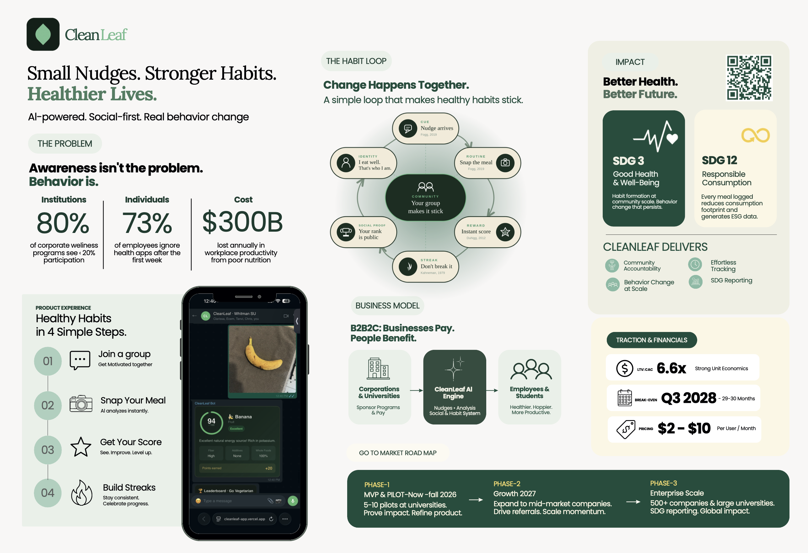

# CleanLeaf
**Small Nudges. Stronger Habits. Healthier Lives.**

> 📎 [Slide Deck](CleanLeaf_SlidesDeck.pdf) · [Demo](https://drive.google.com/file/d/1e6eUU4Q5htVULxVDf_g5bFewJLzu_HIp/view?usp=share_link) · [Poster](CleanLeaf%20Poster.pdf) · [Full Report](CleanLeaf_Report_DSG_Challenge_2026.pdf)

CleanLeaf is an AI-powered community wellness platform for universities and workplaces. Institutions pay for it; their people benefit from it. Users receive a message on WhatsApp or Microsoft Teams, tap a link, photograph their meal, and an AI scores it instantly. No app download, no sign-up, no friction. Groups compete on leaderboards, healthy habits form, and institutions receive board-ready sustainability reports tied directly to their ESG commitments.

Built for the Whitman Dean's Sustainability Challenge 2026 (2nd Place).

---

## The Problem

Wellness programs exist everywhere. They work almost nowhere.

- **80%** of corporate wellness programs see less than 20% participation
- **73%** of employees abandon health apps within the first week
- **$575B** lost annually by U.S. employers through absenteeism and lost productivity from poor employee health

The failure isn't awareness since most people know eating well matters. The failure is design. Standalone apps demand behavior change before any habit has formed, offer no social accountability, and exist outside the platforms people already use every day.

---

## How CleanLeaf Works

Four steps. Twenty seconds. No new app.

1. **Join a group** : your team, your sorority, your department
2. **Snap your meal** : tap the link in your WhatsApp or Teams message, take a photo
3. **Get your score** : AI identifies the food and scores it instantly against nutritional benchmarks
4. **Build streaks** : stay consistent, climb the leaderboard, celebrate with your group

The social layer is the engine. When your group's rank is public, showing up stops feeling like a personal health task and starts feeling like not letting people down. That's what makes habits stick.

---

## What's In It for Employees & Students

- **Zero friction** — no download, no account, no onboarding. One tap from a message they already received
- **Instant feedback** — a nutrition score appears within seconds of photographing a meal
- **Social accountability** — group leaderboards make healthy eating a shared experience, not a solo effort
- **Streaks and momentum** — progress is visible, which makes continuing easier than stopping
- **Privacy** — individual data stays private; only group-level standings are shared publicly

---

## What's In It for Companies & Universities

**Productivity gains.** Poor nutrition costs U.S. employers $575B annually in absenteeism and lost output. Even modest, sustained improvements in eating habits compound meaningfully across a workforce over time.

**Health insurance leverage.** Healthier populations file fewer claims. Because CleanLeaf tracks behavior at the *group level*, never the individual, employers can demonstrate aggregate wellness improvements to insurers without exposing any personal health data. No names, no individual records, just cohort-level trends that can support conversations about premium reductions over time.

**ESG and SDG reporting.** Large institutions are now subject to mandatory sustainability disclosure requirements across the EU, UK, Canada, and parts of the United States. Every meal logged on CleanLeaf maps directly to two UN Sustainable Development Goals:
- **SDG 3** — Good Health & Well-Being: habit formation at community scale
- **SDG 12** — Responsible Consumption: steering communities toward less processed, lower-impact food choices

The platform generates a board-ready ESG report automatically based on goals set by the institutions, turning everyday dining decisions into documented, auditable impact.

**Low administrative overhead.** Administrators manage everything through a single dashboard such as importing contacts, scheduling nudges, tracking engagement, and exporting reports without needing technical support.

---

## Business Model

CleanLeaf operates on a B2B2C model. Institutions are the paying customers; their communities are the beneficiaries.

| | |
|---|---|
| **Pricing** | $2–$10 per user / month (tiered by institution size) |
| **LTV : CAC** | 6.6x |
| **Break-even** | Q3 2028 |
| **Market** | $61.9B global corporate wellness market, growing at 5.9% annually |

**Go-to-market:**
- **Phase 1 (Now – Fall 2026):** MVP pilot with 50–100 Syracuse University students
- **Phase 2 (2027):** Expand to mid-market companies; drive referrals
- **Phase 3 (2028+):** 500+ companies and large universities; full SDG reporting suite; global scale

---

## Team

**Clarissa Karki · Ecem Ipek · Tanvi Mahadik · Chris Kapsalis**
Whitman School of Management, Syracuse University
Whitman Dean's Sustainability Challenge 2026 - 2nd Place
